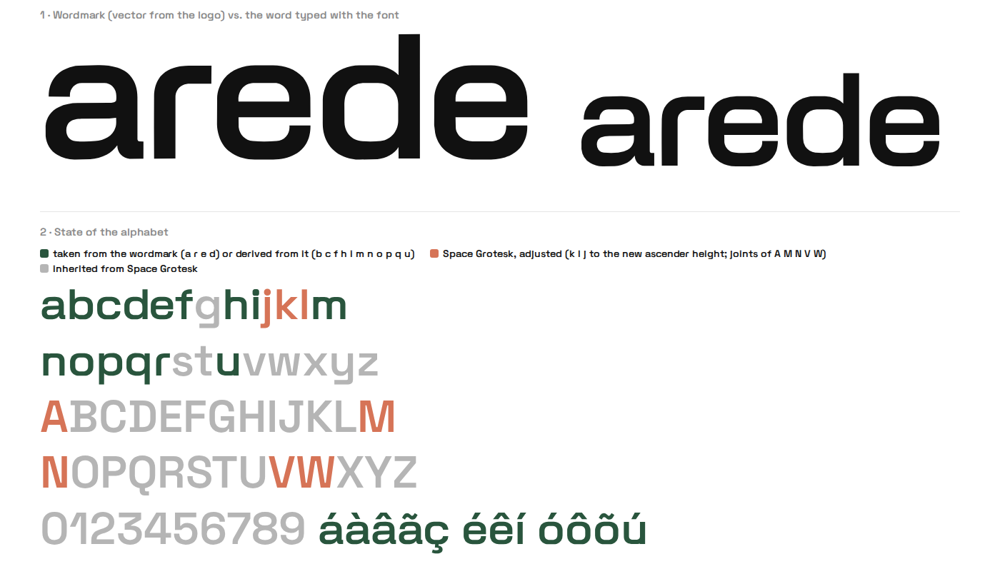

<p align="center"></p>

# Arede Grotesk

[](https://github.com/aredebr/arede-grotesk/releases/latest)
[](OFL.txt)
[](https://aredebr.github.io/arede-grotesk/)

Arede Grotesk is the typeface of the Arede brand. It grows out of the arede wordmark: the four letters of the logo (a, r, e, d) are used exactly as drawn, and the rest of the alphabet follows their rules — flat, orthogonal terminals, squared bowls, and the hooked r that gives the family its voice.

It is derived from [Space Grotesk](https://github.com/floriankarsten/space-grotesk) by Florian Karsten and Květoslav Bartoš, and is released under the [SIL Open Font License 1.1](OFL.txt). You can use it, embed it, modify it and redistribute it, free of charge, in personal and commercial work.

## Download

**[Download Arede Grotesk 1.1](https://github.com/aredebr/arede-grotesk/releases/latest)** — OTF, TTF and WOFF2, with the license.

## Install

- **macOS:** double-click `AredeGrotesk-Regular.otf` and choose *Install Font*.
- **Windows:** right-click `AredeGrotesk-Regular.ttf` and choose *Install*.
- **Figma, Adobe apps, Office:** the font shows up as **Arede Grotesk** once installed.

## Use on the web

```css
@font-face {
  font-family: "Arede Grotesk";
  src: url("AredeGrotesk-Regular.woff2") format("woff2");
  font-weight: 600;
  font-display: swap;
}
body { font-family: "Arede Grotesk", "Space Grotesk", sans-serif; }
```

You can also load it straight from this repository through jsDelivr, with nothing to host:

```
https://cdn.jsdelivr.net/gh/aredebr/arede-grotesk@v1.1.0/fonts/webfonts/AredeGrotesk-Regular.woff2
```

## Features

- One style: Regular, sitting at 600 on the CSS weight scale — the weight of the wordmark.
- Full Latin character set, covering Portuguese and every language Space Grotesk covers.
- `ss06`: n with both corners rounded (`font-feature-settings: "ss06"`).
- Space Grotesk's OpenType features are kept: stylistic sets ss01–ss05, tabular and old-style figures, fractions, slashed zero, case-sensitive punctuation.

## About version 1.1

Version 1.1 refines the drawing. The m is now the n arch repeated twice, with the same notch where the arch leaves the stem and a cleaner line along the x-height. The f loses the corner where the hook meets the stem. In A, M, N, V and W the joints of the diagonals are as thick as the horizontal bars, so these capitals no longer look lighter at the apex and at the base.

Version 1.0 redesigned the lowercase core. The letters a, r, e and d are the wordmark itself; b, c, f, h, i, m, n, o, p, q and u are built from them; k, l and j follow the new ascender height. Every accented form of these letters follows automatically. All other glyphs — the remaining lowercase, the capitals, figures, punctuation and symbols — come from Space Grotesk, so the character set is complete and production-ready.

## Live specimen

[aredebr.github.io/arede-grotesk](https://aredebr.github.io/arede-grotesk/)

## Building from source

The editable source is the UFO in `sources/`. With Python 3.10 or newer:

```sh
pip install -r requirements.txt
./scripts/build.sh
```

Fonts land in `fonts/`. Builds are reproducible: the fonts are stamped with the date of the last commit that changed `sources/`, so rebuilding unchanged sources gives identical files. GitHub Actions builds and checks the fonts on every push.

To release, add a `## X.Y.Z — YYYY-MM-DD` section to `CHANGELOG.md`, then run the *Release* workflow from the Actions tab (or push a `vX.Y.Z` tag). The release notes are that CHANGELOG section plus the footer in `.github/release-notes.md`; preview them with `./scripts/release_notes.sh X.Y.Z`.

## Credits and license

Arede Grotesk — Copyright 2026 The Arede Grotesk Project Authors. Designed by Marcio Arêde for Arede.

Derived from Space Grotesk — Copyright 2020 The Space Grotesk Project Authors (Florian Karsten, Květoslav Bartoš).

Licensed under the SIL Open Font License, Version 1.1. See [OFL.txt](OFL.txt). "Arede Grotesk" is a Reserved Font Name.

Arede and the arede logo are trademarks of Arede; the font license does not grant trademark rights.
